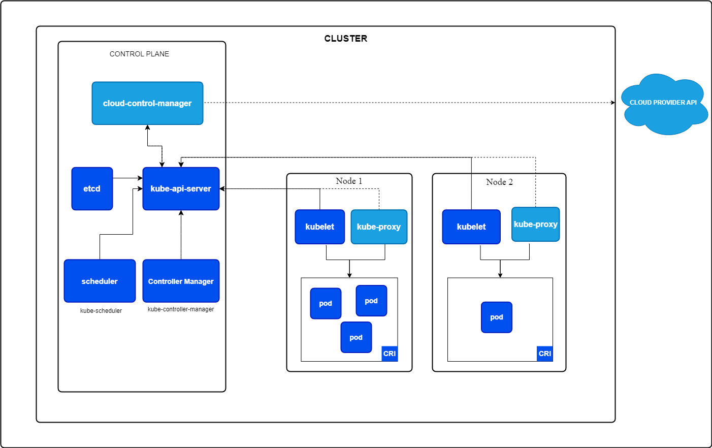

### K8S Cluster
- <b>Pod</b> is a collection of one or more containers, and is the smallest unit of a Kubernetes application.

- A Kubernetes cluster consists of a control plane plus a set of worker machines, called nodes, that run containerized applications. Every cluster needs at least one worker node in order to run Pods.

- The worker node(s) host the Pods that are the components of the application workload. The control plane manages the worker nodes and the Pods in the cluster. In production environments, the control plane usually runs across multiple computers and a cluster usually runs multiple nodes, providing fault-tolerance and high availability.

- We use yaml file for configuring the pods, where as in docker we use various commands

### Kubernetes Architecture
Kubernetes consists of two major components: Master Node (Control Plane) and Worker Node.

### 1. Components of the Worker Node:
The worker node is responsible for running application workloads.

<b>1.1 Container Runtime:</b>
Manages the lifecycle of containers.
Example: Docker, containerd (replaced Dockershim since Kubernetes v1.20).

<b>1.2 Kubelet:</b>
Responsible for ensuring that containers are running in a Pod.
Monitors the health of Pods and interacts with the API server to receive instructions.
If the pod is not running, the kubelet will respond to health checks and attempt to restart it.

<b>1.3 Kube-proxy:</b>
Manages network rules on nodes.
Ensures network connectivity for services within and outside the cluster.
Provides load balancing for services across Pods.

### 2. Components of the Master Node (Control Plane):
The control plane is responsible for managing the state and behavior of the cluster. 

<b>2.1 Kube-apiserver:</b>
The core component that exposes the Kubernetes API.
Acts as the frontend for the Kubernetes control plane.
All cluster components communicate through it.

<b>2.2 Scheduler:</b>
Assigns Pods that are not yet bound to any node, to the most appropriate node.
Considers factors like resource availability, policies, and affinities.

<b>2.3 etcd:</b>
A highly available key-value store.
Stores all cluster data, including configuration and the current state of resources.
Acts as the "brain" of Kubernetes, ensuring consistency across the cluster.

<b>2.4 Kube-controller-manager:</b>
Runs various controllers that monitor the state of the cluster.
Ensures the cluster matches the desired state, such as maintaining a specific number of replicas.

<b>2.5 Cloud Controller Manager:</b>
Manages cloud-specific control logic.
Integrates Kubernetes with underlying cloud providers like AWS, GCP, or Azure for managing services like load balancers, volumes, and instances.

### 3. Additional Control Plane Components:

<b>3.1 CoreDNS:</b>
A cluster add-on responsible for DNS resolution within the cluster.
Helps services discover each other via DNS names.

<b>3.2 Ingress Controller:</b>
Manages access to services from external sources.
Acts as an entry point for external traffic.
Kubernetes Architecture Overview:
The Control Plane ensures the desired state of the cluster is maintained and schedules workloads.

The Worker Nodes execute the actual workload (containers) in Pods, while kube-proxy handles networking.
