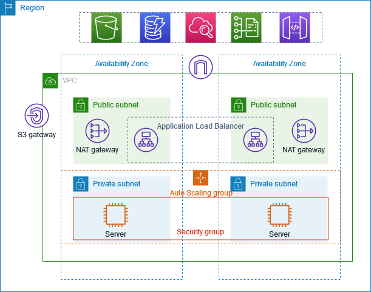

### Project: Load Balanced Web Application with Auto Scaling and Secure Access

<b>Description:</b> In this project, We have implemented deploying a web application using AWS services like ALB, AutoScaling and Bastian host.
This project demonstrates the deployment of a web application architecture with load balancing across multiple EC2 instances, It also has auto scaling group with the desired capacity of 2 and max is 4 and min is 1, we are connecting to the ec2 in private subnet with the ec2 present in public subnet which is known as <b>Bastian host</b>.
<br><br>


<b>The setup includes:</b> <br>
<b>VPC Creation:</b> Created a Virtual Private Cloud (VPC) with a NAT Gateway in each Availability Zone (AZ) and no VPC endpoints.

<b>Auto Scaling Group (ASG):</b> Configured an Auto Scaling group by first creating a launch template and then setting up the ASG to automatically manage EC2 instances in private subnets across different AZs. Desired capacity of 2 and max is 4 and min is 1

<b>EC2 Instances:</b> Deployed EC2 instances in private subnets of each Availability Zone (a and b) via the Auto Scaling group.

<b>Bastion Host:</b> Established a Bastion host in a public subnet to facilitate secure access to EC2 instances within the private network.

<b>Key Pair Management:</b> Uploaded the key pair (kp) from git bash to the Bastion host to enable SSH access to the private EC2 instances, On git bash write this command from the directory where the kp is present.<br>
```scp -i /c/Users/sohai/Downloads/cmd-keypair.pem /c/Users/sohai/Downloads/cmd-keypair.pem ubuntu@13.233.92.11:/home/ubuntu```<br>
<b>syntax:</b> ```scp -i /path/to/kp(for connection) /path/to/src ubuntu@<ip>:/path/to/dest```

<b>Python Server Setup:</b> Accessed both the EC2 instances (On private subnet) through the Bastion host, ran a Python HTTP server on port 8000, and created a basic HTML page on each instance to demonstrate web access.

<b>Application Load Balancer (ALB):</b> Set up an Application Load Balancer in a public subnet. First, created a target group to direct traffic to the EC2 instances in the private subnets.

<b>Target Group Configuration:</b> Configured the target group to distribute traffic to the EC2 instances.

<b>Load Balancer Integration:</b> Attached the target group to the Application Load Balancer to manage traffic routing.

<b>Testing:</b> Accessed the Application Load Balancer’s DNS name to verify that traffic is being correctly distributed to both EC2 instances.