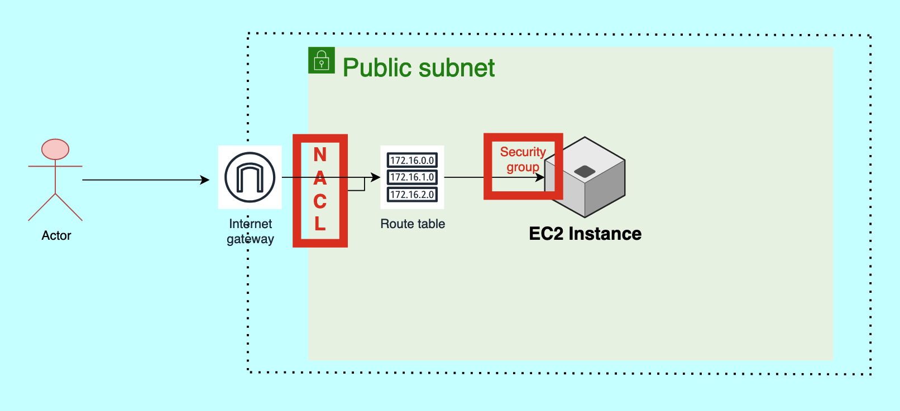

## This is a comprehensive explanation on what is a VPC and how it work

### What is a VPC
- A Virtual Private Cloud (VPC) is like having your own private section of the cloud. Imagine it as a secure, isolated area within the larger AWS cloud where you can run your applications, store data, and connect different parts of your system. In a VPC, you can control who has access to your resources, how they connect, and where your data goes, just like managing a private network in a physical office but in the cloud.

### Real Definition
- A Virtual Private Cloud (VPC) is a logically isolated section of the AWS cloud where you can launch AWS resources in a virtual network that you define. You have full control over your virtual networking environment, including selecting your own IP address range, creating subnets, and configuring route tables and network gateways. VPC allows you to isolate and secure your resources while enabling communication between them and controlling access to the internet.

### How VPC Works and its Elements
<b>VPC (Virtual Private Cloud)</b>  
<b>Defining the Size of a VPC:</b> The size of a VPC is determined by its IP address range, which is defined using CIDR (Classless Inter-Domain Routing). For example, a VPC might have an IP range like 10.0.0.0/16, giving it 65,536 possible IP addresses.

<b>Subnet (Sub Network):</b> A VPC is divided into smaller sections called subnets. Subnets can be public (accessible from the internet) or private (isolated from the internet). Public subnets host resources like EC2 instances that need internet access, while private subnets host resources that should not be directly accessible from the internet.

<b>Internet Gateway:</b> This acts like the main entrance for a VPC, allowing traffic from the internet to enter the VPC. It's like a security checkpoint that routes traffic into the VPC. The Internet Gateway is associated with public subnets, enabling internet communication.

<b>Routing Traffic:</b> When a request enters the VPC through the Internet Gateway, it typically goes to a public subnet. From there, the request might be handled by an Elastic Load Balancer (ELB), which distributes the traffic to EC2 instances. The Route Table defines how traffic is directed to different parts of the VPC, including subnets and instances.

<b>Security Group:</b> This acts as a virtual firewall at the EC2 instance level. It controls inbound and outbound traffic for the instance, determining whether traffic is allowed or denied.

<b>NAT Gateways:</b> When an EC2 instance in a private subnet needs to access the internet (e.g., for updates), it uses a NAT Gateway. This allows the instance to make requests without exposing its private IP address to the internet. If IP masking is done via the load balancer, it's known as SNAT (Source Network Address Translation). If done via the Route Table, it involves the NAT Gateway.

<b>NACL (Network ACL):</b> A NACL is a security layer at the subnet level. Unlike Security Groups, which apply to individual EC2 instances, NACLs control traffic for all instances within a subnet. If a subnet has 10,000 EC2 instances, the inbound and outbound rules in the NACL will apply to all of them.

<b>Key Difference Between Security Groups and NACLs:</b>

<b>Security Groups:</b> Used to define inbound and outbound rules for a specific EC2 instance. 
<b>NACLs:</b> Used to define inbound and outbound rules for an entire subnet, affecting all EC2 instances within it.

### Actual Flow 

<b>Internet Gateway:</b> The request first enters the VPC through the Internet Gateway, which is connected to a public subnet. The gateway acts as the entry point for any traffic coming from the internet.

<b>Routing Traffic:</b> Once inside the VPC, the Route Table determines where the request should go. It directs the request to the appropriate subnet based on the IP address and routing rules.

<b>Public Subnet & Elastic Load Balancer (ELB):</b> If the request is directed to a public subnet, it often goes through an Elastic Load Balancer (if one is configured). The ELB balances the incoming traffic across multiple EC2 instances, ensuring even distribution and availability.

<b>Security Group:</b> Before reaching the EC2 instance, the request must pass through the Security Group associated with the instance. The Security Group acts as a virtual firewall, checking the inbound rules to see if the request is allowed. If permitted, the request proceeds to the EC2 instance.

<b>EC2 Instance:</b> The request reaches the EC2 instance, where the application hosted on the instance processes it. If the instance needs to access external services (e.g., for updates or to fetch data), it uses a NAT Gateway if it resides in a private subnet.

<b>Private Subnet & NAT Gateway:</b> If the instance is in a private subnet, it doesn't have direct access to the internet. Instead, it uses a NAT Gateway to make outbound requests without exposing its private IP address. The NAT Gateway forwards the request to the internet, masking the instance's IP.

<b>NACL (Network ACL):</b> Throughout this process, Network ACLs (if configured) provide an additional layer of security at the subnet level, controlling inbound and outbound traffic for all instances within the subnet. NACLs ensure that only allowed traffic can enter or leave the subnet.

<b>Response Handling:</b> Once the EC2 instance processes the request, it sends a response back. If the response needs to go back to the internet, it follows the reverse path, passing through the Security Group, Route Table, and Internet Gateway to exit the VPC.

This flow ensures that the VPC securely handles both inbound and outbound traffic while isolating and protecting internal resources